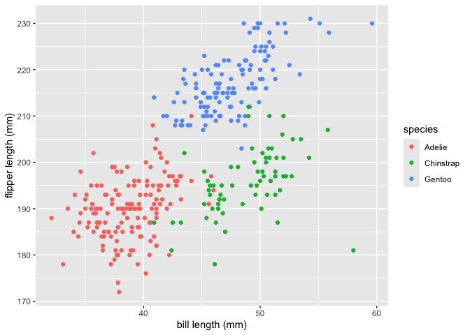

p8105_hw1_yy3563
================
Yifei Yu
2024-09-20

### Problem 1

## Load the penguins dataset.

``` r
library(palmerpenguins)
data("penguins", package = "palmerpenguins")
```

The `penguins` dataset includes data on `species`, `island`,
`bill_length_mm`, `bill_depth_mm`, `flipper_length_mm`, `body_mass_g`,
`sex`, and `year` of penguins from three different species: Adelie,
Gentoo, and Chinstrap.

The dataset has 344 rows and 8 columns.

The mean flipper length of the penguins is 200.9152047 mm.

## Make the scatterplot and export to project directory.

``` r
library(tidyverse)
```

    ## ── Attaching core tidyverse packages ──────────────────────── tidyverse 2.0.0 ──
    ## ✔ dplyr     1.1.4     ✔ readr     2.1.5
    ## ✔ forcats   1.0.0     ✔ stringr   1.5.1
    ## ✔ ggplot2   3.5.1     ✔ tibble    3.2.1
    ## ✔ lubridate 1.9.3     ✔ tidyr     1.3.1
    ## ✔ purrr     1.0.2     
    ## ── Conflicts ────────────────────────────────────────── tidyverse_conflicts() ──
    ## ✖ dplyr::filter() masks stats::filter()
    ## ✖ dplyr::lag()    masks stats::lag()
    ## ℹ Use the conflicted package (<http://conflicted.r-lib.org/>) to force all conflicts to become errors

``` r
plot_penguin = tibble(
  x = penguins$bill_length_mm,
  y = penguins$flipper_length_mm,
  species = penguins$species
)

ggplot(plot_penguin, aes(x = x, y = y, color = species)) + 
  geom_point() +
  labs(x = "bill length (mm)", y = "flipper length (mm)", color = "species")
```

    ## Warning: Removed 2 rows containing missing values or values outside the scale range
    ## (`geom_point()`).

<!-- -->

``` r
ggsave("scatter_penguin.pdf", height = 4, width = 4 )
```

    ## Warning: Removed 2 rows containing missing values or values outside the scale range
    ## (`geom_point()`).
